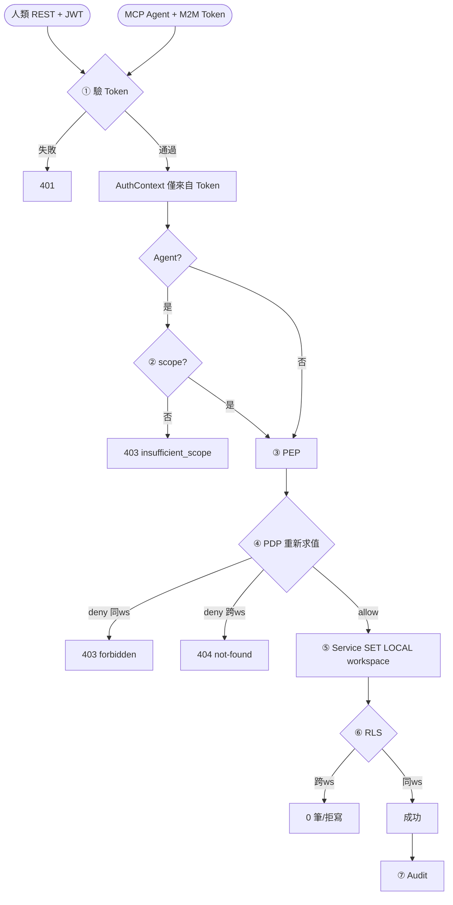

# 安全與授權：多租戶智慧日曆 SaaS 系統

> 狀態：草案 v0.1 · 最後更新 2026-09-14 · 對應 `requirements.md`

## 0. 核心安全不變式

> **INVARIANT：不存在任何繞過授權的資料存取路徑。**
> 無論呼叫者是人類 UI/REST，或 AI Agent 經 MCP，同一筆資料存取都必須穿過同一條防線：
> `Token 驗證 → PEP → PDP(OPA/Casbin) → Service → SET LOCAL app.current_workspace → RLS`。
> **「是 AI 調用」不構成任何豁免。**

## 1. 縱深防禦四層

| 層 | 問的問題 | 位置 | 擋住 |
|---|---|---|---|
| AuthN + Scope | Token 有效？tool 在 scope 內？ | 入口 | 偽造身分/超出授權 |
| PEP/PDP | 此 role 能對此資源做此動作？ | SQL 之前 | 同 workspace 內越權 |
| Service 唯一入口 | — | 應用層 | 繞過 PEP 的裸 SQL 路徑 |
| RLS | 此列屬於此 workspace？ | DB | 跨 workspace 外洩 |

要外洩需 PEP + Service + RLS 三層同時失效。

## 2. 資料隔離底線（ISO-*）

每張業務表帶 `workspace_id`；三層強制：

**連線脈絡（每交易）**
```sql
SET LOCAL app.current_workspace = '<workspace_id from JWT>';
-- LOCAL：隨交易結束自動失效，避免連線池洩漏脈絡
```

**RLS Policy（每張帶 workspace_id 的表）**
```sql
ALTER TABLE <t> ENABLE ROW LEVEL SECURITY;
ALTER TABLE <t> FORCE  ROW LEVEL SECURITY;   -- 連 owner 也套用
CREATE POLICY workspace_isolation ON <t>
  USING      (workspace_id = NULLIF(current_setting('app.current_workspace', true), '')::uuid)
  WITH CHECK (workspace_id = NULLIF(current_setting('app.current_workspace', true), '')::uuid);
-- workspaces 表隔離鍵為自身 id，policy 用 id 而非 workspace_id
```
- `NULLIF(current_setting(..., true), '')`：未設脈絡時 current_setting 回空字串 `''`，NULLIF 轉為 NULL → 不匹配 → 0 筆（ISO-4）。直接 `''::uuid` 會擲錯，故必須 NULLIF。
- 應用角色 `app_user` 無 `BYPASSRLS`/superuser（ISO-5）。

**Repository 收斂**：所有 DB 存取經統一 Repository，自動注入 workspace 條件；禁止 service/handler 裸 SQL。

## 3. JWT 設計
- Access token（~15min）+ Refresh token（可撤銷，Redis 黑名單）。
- Claims：`sub`, `workspace`, `roles`, `exp/iat/aud/iss`。
- **`workspace` claim 是脈絡唯一來源**（ISO-3）；本機 HS256，正式 RS256/JWKS。

## 4. PEP → PDP（授權求值）

**時序（一次請求）**
```
Request+JWT → [AuthN onRequest] 驗 JWT → AuthContext
           → [PEP preHandler] authorize(input) → PDP 求值
                deny → 403(同 ws)/404(跨 ws)，SQL 永不執行
                allow → Handler → 開交易 SET LOCAL workspace → SQL(RLS 兜底)
```

**AuthZ Query（PEP→PDP 輸入）**
```jsonc
{ "subject": { "sub":"usr_42","workspace":"ws_9","roles":["scheduler"] },
  "action": "event.update",
  "resource": { "type":"event","id":"evt_1","workspace":"ws_9",
                "owner_id":"mem_7","visibility":"private" },
  "context": { "ip":"…","now":"…" } }
```

**條文（PEP-*）**
- **PEP-1** 授權求值 SHALL 於 SQL 之前；deny SHALL 中止請求。
- **PEP-2** subject SHALL 僅來自 JWT；resource/action 由 route 決定，不採信 client。
- **PEP-3** 每請求 SHALL 重新求值，不快取決策（REQ-A2）。
- **PEP-4** PEP 邏輯 SHALL 與框架解耦（`authorize(input)`）。
- **PEP-5** ABAC 屬性預讀 SHALL 仍綁 workspace_id，不取代 PDP 決策。
- **PEP-6** deny SHALL 記稽核；跨 ws 回 404、同 ws 越權回 403。
- **PEP-7** MCP tool call SHALL 走同一 authorize 鏈。

## 5. PDP 選型
- **OPA**（預設）：獨立 `opa` 容器，Rego 政策版本控管，適合 ABAC（visibility/owner 條件）。
- **Casbin**：in-process，domain=workspace，適合純 RBAC。

**Rego 範例**
```rego
package calendar.authz
default allow = false
allow { input.subject.roles[_] == "admin"
        input.resource.workspace == input.subject.workspace }
allow { input.action == "event.update"
        input.resource.owner_id == input.subject.sub }
```

## 6. 零信任（MCP Agent，ZT-*）

外部 agent 為不受信任呼叫者。每次 tool call：
```
[1] AuthN 驗 M2M token(含撤銷)   [2] Scope: tool∈token.scope
[3] PEP→PDP 重新求值             [4] SET LOCAL workspace
[5] SQL(RLS 兜底)                [6] Audit(actor_type=agent)
```
Agent 實際權限 = **scope ∩ role 權限**（取交集）。

**條文**
- **ZT-1** 所有存取穿過同一防線，無繞過路徑。
- **ZT-2** Agent tool 強制通過 PEP + RLS，AI 不豁免。
- **ZT-3** MCP handler 不得直接存取 DB，僅經共用 Service/Repository。
- **ZT-4** 每次求值，不快取；token 撤銷即時生效。
- **ZT-5** workspace/sub 僅來自 token，不來自 tool 參數。
- **ZT-6** agent DB 角色無 BYPASSRLS、不跨 workspace。
- **ZT-7** CI 含 agent 越權/跨 ws 滲透測試。
- **ZT-8** 每個 agent tool call（allow+deny）記稽核。

## 7. 明確禁止（Anti-patterns）
- ❌ MCP handler 直連 DB / 裸 SQL。
- ❌ 給 agent 跨 workspace 或 BYPASSRLS 的 service account。
- ❌ 為效能快取 PDP 決策放行後續呼叫。
- ❌ 從 tool 參數讀 workspace_id/sub 作授權依據。
- ❌ 略過 agent 稽核。

## 8. Mermaid：兩路徑匯流的權限檢查


